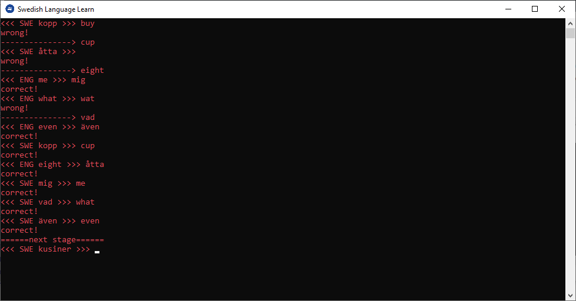

# Swedish Learning Script

## Version 1.0

I designed this script to learn Swedish. In my own environment, I packaged it to become lalearn.exe and I just run it as is. 

## How it works

On the CLI, it will immediately ask you for a word either in ENG or SWE which you will have to translate into the other. You will get a pass for correct and fail for wrong. It will give you 5 pairs to translate and you need to move on to the next "stage" by passing each pair successfully. Even if you have 1 wrong after having 4 correct will not allow you to proceed and have you repeat all 5 pairs successfully.

Each time you run it anew, it will show you words to translate and then mark them off as "used". This "used" flag will only be relevant for your current run and wiped the next time the script is started. The system will prioritize showing you items that you passed < 2 times and items you failed at > 1 time so that you can focus on what you didn't know and pairs you have not used before.

Type exit() to exit the script at any time. If you don't know a word, just press Enter!

## Updating or adding new Swedish Words

Words are stored in the swedish.csv file and this can be updated. The columns are as follows:

- swedish 
- english
- fail
- pass	
- used

## Your Progress

Your progress is stored in the progress.csv file and will be updated as you use the script. The system will add new words to this file if you have added them to swedish.csv

## Updates

I will make updates as time goes by as I am using the script to learn Swedish. In the future, I can make it more flexible to accommodate other languages as well.